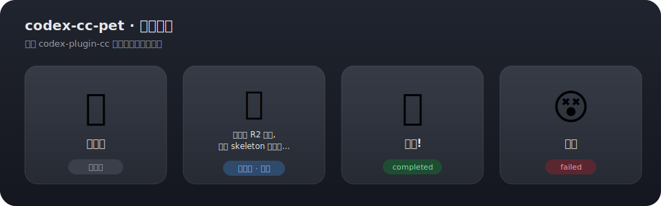
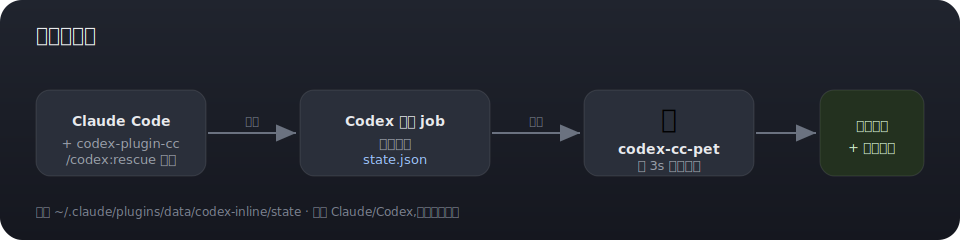

# codex-cc-pet

[中文](README.md) | **English**

> A tiny macOS desktop companion for [**codex-plugin-cc**](https://github.com/openai/codex-plugin-cc) — a pet that reflects your Codex background-job status and notifies you when jobs finish.

When you delegate tasks to Codex in the background via the plugin (inside Claude Code), this pet **shows the live status and pops a system notification when a job finishes** — filling the gap where finished background jobs go unnoticed and you have to keep running `/codex:status`.

A single self-contained `.app`: **double-click to run, copy it to any Mac and double-click there too** (universal binary, Intel / Apple Silicon). No node, no install scripts.



## Requirements

This tool **only works with [codex-plugin-cc](https://github.com/openai/codex-plugin-cc)** (the Claude Code × Codex plugin). It reads the job state that plugin writes locally; it does **not** target the Codex CLI or the Codex desktop app — using those alone produces no data.

- macOS 12+
- [codex-plugin-cc](https://github.com/openai/codex-plugin-cc) installed and used to dispatch background jobs (`/codex:rescue`, etc.)

## Usage

- **Run**: double-click `codex-cc-pet.app` (or `open codex-cc-pet.app`).
- **Move**: drag the card background.
- **Quit**: double-click the card.
- **Launch at login**: System Settings → General → Login Items → `+` → select `codex-cc-pet.app`.
- **Notifications**: macOS will ask for permission the first time a job finishes — allow it once.

## Behavior

Every 3 seconds it read-only scans the plugin's job state files (`~/.claude/plugins/data/codex-inline/state/<project>/state.json`):

| State | Pet | Notification |
|---|---|---|
| Idle (no jobs) | 🐤 slow breathing bob | — |
| Working (≥1 running) | 🐤 faster bob, bubble shows **live Codex narration** | — |
| Done (just completed) | 🎉 hop (5s) | ✅ system notification + summary |
| Failed (just failed) | 😵 shake (6s) | ⚠️ system notification + summary |

The live narration comes from the latest `Assistant message` line in the active job's `logFile`.

## How it works



## Move to another Mac

Just copy `codex-cc-pet.app` over and double-click. The binary is universal, so the target machine needs **no node, no swiftc, no install**.

> If Gatekeeper blocks the unsigned app on first launch: right-click → Open, or System Settings → Privacy & Security → Open Anyway.

## Build from source

```bash
./build.sh   # compiles codex-cc-pet.swift into a universal binary inside codex-cc-pet.app
```

Requires Xcode Command Line Tools (`xcode-select --install`, provides `swiftc`). Only needed on the build machine — not for running the distributed `.app`.

## Files

| File | Description |
|---|---|
| `codex-cc-pet.swift` | All source (native AppKit, no third-party deps) |
| `codex-cc-pet.app` | Distributable app (`Contents/MacOS/codex-cc-pet` is a build artifact, gitignored) |
| `build.sh` | Rebuild script (universal binary + icon) |

## License

MIT
